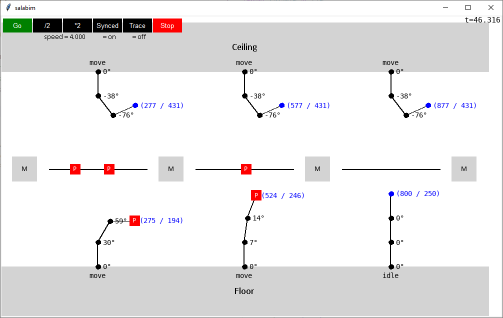
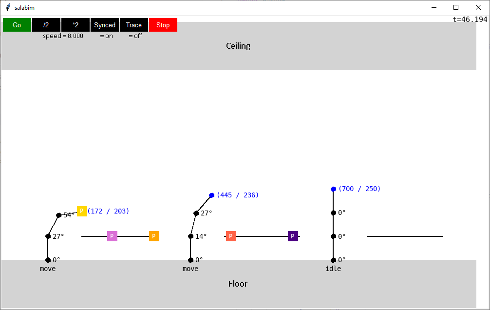

# salabim-plant

This project provides a framework for **Plant Simulation** with [Python](https://www.python.org/) based on the amazing [Salabim](https://www.salabim.org/) package. Note that Salabim provides easy to use **Discrete Event Simulation** as well as **2D / 3D Visualization** capabilities for Python programmers. Consequently, you can build industrial grade simulation environments base on this software stack. Feel free to contact us for more information about our framework and its application to real-world scenarios!

## 🖼️ Screenshots

Here are some screenshots showing the simulation package in action.

### Model A

The first model features six robots (three mounted on the floor and three mountend on the ceiling) as well as three conveyors and four machines.



### Model B

The second model features three robots (all mounted on the floor) as well as three conveyors and no machines.



## 👨‍💻 Examples

Here is an example of how to use our plant simulation package. Note that this is just a code sketch, which will not run due to syntax error. Please 

```python
import salabim
import salabim_plant

# Create simulation environment
env = salabim.Environment()

# Enable 2D animation
env.animate(True)
env.width(1000)
env.height(600)
env.position((100, 100))

# Create robot
robot = salabim_plant.Robot(
    base_position = salabim_plant.Vector(400, 300),
    base_angle = 0
)
s
# Create product grabbed by robot
product = salabim_plant.Product(
    position_controller = robot,
    color = "blue"
)

# Run infinite simulation
env.run(salabim.inf)
```

## 📈 Diagrams

Here are some diagrams explaing the software architecture of the simulation package.

### Classes

The following diagram shows the classes of the simulation package, which are based on the classes of the salabim package.

